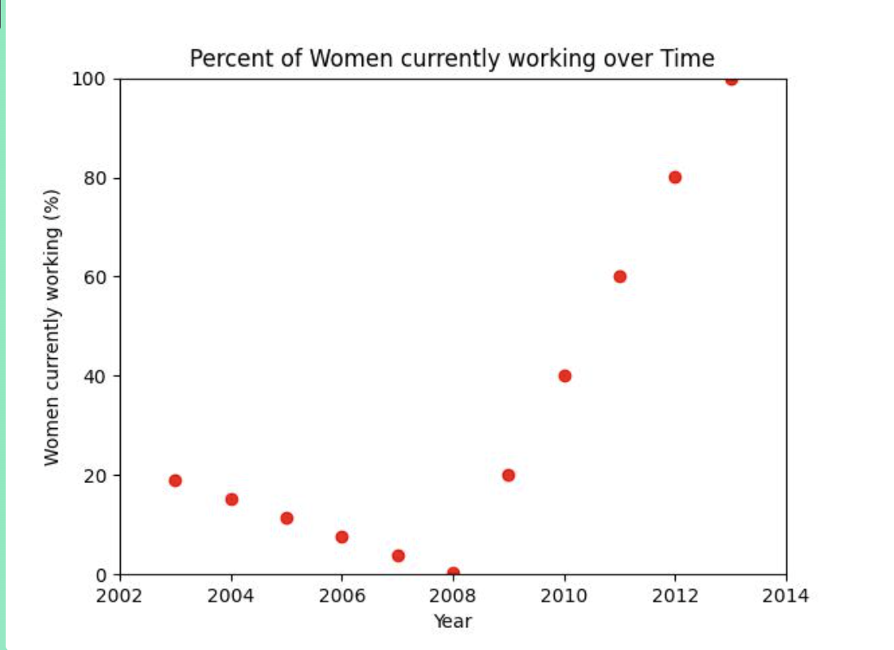

# Women Working in Turkey

A data analysis project exploring how the percentage of working women in Turkey changed over time.

## Demo

[View the project on Girls Who Code TextJam](https://hq.girlswhocode.com/TextJam/py/17330/8b66d874)

## How I Made It

- **Language:** Python
- **Libraries:** Pandas, Matplotlib, GWCutilities
- **Dataset:** LivWell

I used the GWC Pathways project instructions and starter code to analyze the data and create a scatter plot.

## What I Learned

- How to read and filter data with Pandas
- How to create scatter plots with Matplotlib
- How to analyze trends in a dataset

## What I Struggled With

I had trouble figuring out how to filter the dataset to look at only Turkey and create the graph I wanted.
